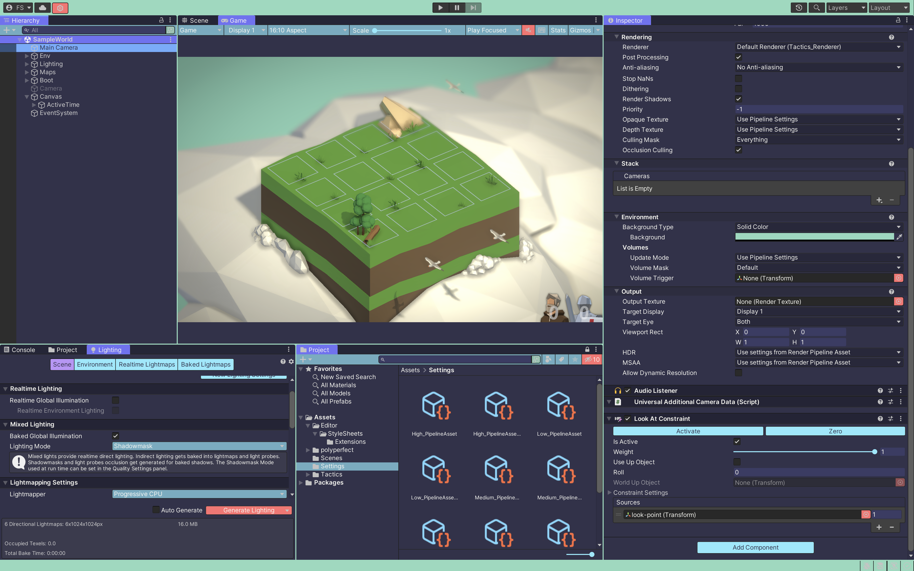

> [!IMPORTANT]
> Since @gr1m0h is not currently using Unity in their daily life, this repository is a Public Archive. 
> If you woul like to contribute, please check the [#3](https://github.com/gr1m0h/rain-unity/issues/3).

# [Rain](https://github.com/85clab0/rain-theme) for [Unity](https://unity.com/ja)

## Install

[Install](INSTALL.md)

## License

[MIT License](LICENSE)
